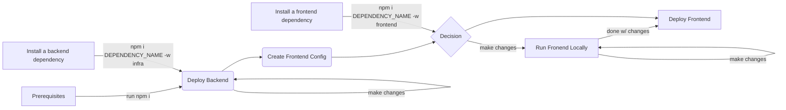

# Contributing Guidelines

Thank you for your interest in contributing to our project. Whether it's a bug report, new feature, correction, or additional documentation, we greatly value feedback and contributions from our community.

Please read through this document before submitting any issues or pull requests to ensure we have all the necessary
information to effectively respond to your bug report or contribution.

## Code of Conduct

This project has adopted the [Amazon Open Source Code of Conduct](https://aws.github.io/code-of-conduct).
For more information see the [Code of Conduct FAQ](https://aws.github.io/code-of-conduct-faq) or contact
opensource-codeofconduct@amazon.com with any additional questions or comments.

## Reporting Bugs/Feature Requests

We welcome you to use the GitHub issue tracker to report bugs or suggest features.

When filing an issue, please check existing open, or recently closed, issues to make sure somebody else hasn't already
reported the issue. Please try to include as much information as you can. Details like these are incredibly useful:

- A reproducible test case or series of steps
- The version of our code being used
- Any modifications you've made relevant to the bug
- Anything unusual about your environment or deployment

## Contributing via Pull Requests

Contributions via pull requests are much appreciated. Before sending us a pull request, please ensure that:

1. You are working against the latest source on the _main_ branch.
2. You check existing open, and recently merged, pull requests to make sure someone else hasn't addressed the problem already.
3. You open an issue to discuss any significant work - we would hate for your time to be wasted.

> **Warning**
> Please avoid opening a PR before having discussed your change, and having reached an agreement on it, with a maintainer. PRs that don't have an issue or that were not agreed upon will not be reviewed.

To send us a pull request, please:

1. Fork the repository.
2. Modify the source; please focus on the specific change you are contributing. If you also reformat all the code, it will be hard for us to focus on your change.
3. Ensure local tests pass.
4. Commit to your fork using clear commit messages.
5. Send us a pull request, answering any default questions in the pull request interface.
6. Pay attention to any automated CI failures reported in the pull request, and stay involved in the conversation.

GitHub provides additional document on [forking a repository](https://help.github.com/articles/fork-a-repo/) and
[creating a pull request](https://help.github.com/articles/creating-a-pull-request/).

## Finding contributions to work on

Looking at the existing issues is a great way to find something to contribute on. As our projects, by default, use the default GitHub issue labels (enhancement/bug/duplicate/help wanted/invalid/question/wontfix), looking at any 'help wanted' issues is a great place to start.

## Setup

The instructions below detail the steps needed to setup and operate the frontend and backend applications. For additional clarity, check also the diagram below that shows the suggested lifecycle during development:



### Prerequisites

- [Node.js >= 16.x](https://nodejs.org/download/release/latest-v16.x/)
  - We recommend using a version in [Active LTS](https://nodejs.org/en/about/releases/)
  - If you use [nvm](https://github.com/nvm-sh/nvm#nvmrc) or [fnm](https://github.com/Schniz/fnm) you can install the latest LTS version with `nvm use` or `fnm use` respectively. Both will use the `.nvmrc` file in the project's root.
- [npm 8.x](https://www.npmjs.com/)
  - After installing Node.js, you can install `npm` with `npm install -g npm@next-8`
- [AWS CLI](https://docs.aws.amazon.com/cli/latest/userguide/getting-started-install.html)
  - Version 2.x is recommended, but version 1.x should work fine
- [jq](https://stedolan.github.io/jq/)
  - If you're on macOS, you can install `jq` with `brew install jq`

First, [fork](https://docs.github.com/en/get-started/quickstart/fork-a-repo) the repository, and then run the following commands to clone and initialize the repository locally.

```sh
git clone https://github.com/{your-account}/powertools-for-aws-lambda-workshop.git
cd powertools-for-aws-lambda-workshop
npm ci
```

### Deploy Backend

The backend resources for this project are deployed via AWS CDK. To deploy the backend run the command below after having installed all the dependencies in the project root.

```sh
npm run infra:deploy
```

By default, the command above will deploy the backend stack using the Node.js AWS Lambda runtime for all modules of the workshop. If you want to deploy the stack using another runtime, you can do so by setting the `LANGUAGE` environment variable to the desired runtime.

```sh
LANGUAGE=python npm run infra:deploy
```

Available runtimes are:
- `nodejs` - Node.js 18.x
- `python` - Python 3.11
- `java` - Java 17
- `dotnet` - .NET 8.0

### Create Frontend Config

In order for the Frontend application to be able to connect to your AWS environment you need to create a configuration file at `frontend/src/aws-exports.cjs`.

#### Automated (recommended)

After having deployed the backend, while in the project's root, run the command below:

```sh
npm run utils:createConfig
```

This command will execute a script (found at `scripts/create-aws-exports.mjs`) that reads the output file generated by CDK (found at `infra/cdk.out/params.json`) and the fronend config file for you.

#### Manual

If you prefer, you can also create the config file manually. Using your favorite IDE, create and edit a file at `frontend/src/aws-exports.cjs`, then edit its content with the appropriate values.

> **Note**
> Make sure to replace all the values in the `frontend/src/aws-exports.cjs` file with the one found in the Outputs section of the AWS CloudFormation Stack.

```js
const awsmobile = {
  Auth: {
    region: "AWS_REGION",
    identityPoolId: "COGNITO_IDENTITY_POOL_ID",
    userPoolId: "COGNITO_USER_POOL_ID",
    userPoolWebClientId: "COGNITO_CLIENT_ID",
  },
  API: {
    endpoints: [
      {
        name: "main",
        region: "AWS_REGION",
        endpoint: "https://CLOUDFRONT_DISTRIBUTION_URL/api",
      },
    ],
  },
};
export default awsmobile;
```

### Run Frontend Locally

While developing and making changes to the frontend you can run the application locally. This allows you to see the changes in near-real-time.

To run the frontend locally, execute the command below while in the project's root:

```sh
npm run frontend:start
```

The command above will make the frontend application available at `http://localhost:8080/` and will automatically hotswap the code as soon as you save changes in your IDE.

### Deploy the Frontend

Once you are ready to deploy you need to bundle the frontend application, deploy it to S3, and optionally invalidate the CloudFront cache.

While in the project's root, run the command below to build the app:

```sh
npm run frontend:build
```

Then, while still in the project's root, you can deploy the changes to the S3 bucket linked to the CloudFront distribution by running:

```sh
npm run frontend:deploy
```

Finally, if you don't want to wait for the changes to be gradually replicated across CloudFront's global network, you can force a cache invalidation by running:

```sh
npm run frontend:invalidateCache
```

The three commands above map to:

- `npm run frontend:build` - This command runs `tsc & vite build` in the `frontend` folder. These commands create a transpiled and optimized bundle of the React application. All outputs are in the `frontend/build` folder.
- `npm run frontend:deploy` - This command removes any existing frontend file (by running `aws s3 rm s3://$(cat ../infra/cdk.out/params.json | jq -r '.powertoolsworkshopinfra | with_entries(select(.key|match(\".*WebsiteBucketName[a-zA-Z0-9_]+\"))) | to_entries | map([.value])[0][0]') --exclude uploads --recursive`) and then deploys the new files (by running `aws s3 sync build/ s3://$(cat ../infra/cdk.out/params.json | jq -r '.powertoolsworkshopinfra | with_entries(select(.key|match(\".*WebsiteBucketName[a-zA-Z0-9_]+\"))) | to_entries | map([.value])[0][0]') --exclude uploads`)
- `npm run frontend:invalidateCache` - This command invalidates the CloudFront cache by running the `aws cloudfront create-invalidation --paths \"/index.html\" --distribution-id $(cat ../infra/cdk.out/params.json | jq -r '.powertoolsworkshopinfra | with_entries(select(.key|match(\".*DistributionId[a-zA-Z0-9_]+\"))) | to_entries | map([.value])[0][0]')` command which invalidates the `/index.html` file.

### Modify dependencies

This project uses [npm workspaces](https://docs.npmjs.com/cli/v8/using-npm/workspaces) to centrally manage dependencies for the project and as such it uses a single `package-lock.json` file that is found in the project's root.

The workspaces currently available in this project are:

- `infra` - Workspace that contains an AWS CDK project and is used to define and provision the architecture
- `functions` - Workspace that contains the AWS Lambda functions deployed as part of the `infra` stack
- `frontend` - Worspace that contains a React application built with [`vite`](https://vitejs.dev)
- `scripts` - Workspace that contains utility scripts for the project

Each workspace has its own `package.json` file where you can find its respectivey dependency list.

If you want to add/remove a dependency to a given workspace you can do so by running `npm [install|remove] $PACKAGE_NAME -w $WORKSPACE_NAME`.

```sh
# This command installs the axios package as regular dependency of the frontend workspace
npm i axios -w frontend
```

```sh
# This command removes the node-fetch devDependency from the infra workspace
npm remove -D node-fetch -w infra
```

### Update Workshop Content

The workshop content is hosted on Workshop Studio while the infrastructure of the workshop is deployed via AWS CDK and hosted in this repository. If you make changes to the infrastructure (aka within the `infra/` directory), or to any of the TypeScript functions (aka within the `functions/typescript/` directory), you will need to update the workshop content to reflect those changes.

Updating the workshop stacks is a manual three-step process:

1. Synthesize the workshop stacks, to do so run `npm run infra:synth` and `npm run ide:synth`. This will generate the CloudFormation templates for the workshop stacks and the IDE stack respectively. The resulting templates will be found in the `infra/cdk.out/` directory.
2. Convert the CloudFormation templates output by CDK to vanilla CloudFormation templates. This process is done via the script found at `scripts/convert-template.mjs` and it involves removing the `AWS::CDK::Metadata` and `AWS::CDK::Asset` resources from the templates as well as creating ad-hoc parameters for the assets. To run the script on both stacks, run `npm run infra:wsPrep` and `npm run ide:wsPrep`. The resulting templates will be found in the `infra/cdk.out/deploy` directory under subdirectories named after the stack name.
3. Copy the resulting templates and assets to the `assets` directory of the Workshop Studio project. Then, copy a the both templates also to the `static/cfn/` directory of the Workshop Studio project. Finally, synch the Workshop Studio project to the S3 bucket that hosts the workshop content following the instructions in the Workshop Studio documentation, and make a commit to the Workshop Studio repo.

## Security issue notifications

If you discover a potential security issue in this project we ask that you notify AWS/Amazon Security via our [vulnerability reporting page](http://aws.amazon.com/security/vulnerability-reporting/). Please do **not** create a public github issue.

## Licensing

See the [LICENSE](LICENSE) file for our project's licensing. We will ask you to confirm the licensing of your contribution.
