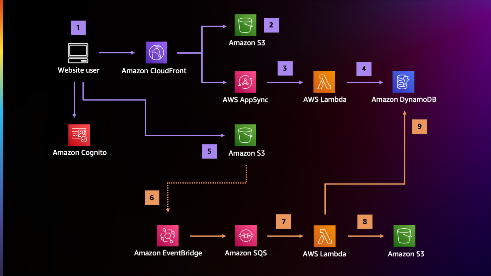

# AWS Lambda Powertools for TypeScript Workshop

The architecture of this workload allows users to upload media assets and have them converted to different web-friendly media formats. The flow of the application is as follows:

1. End users access an authenticated web application that they can use to upload media assets.
2. The application is hosted on Amazon S3  and distributed via Amazon CloudFront.
3. When an user uploads a media asset, the application obtains a pre-signed upload URL from a GraphQL API managed by Amazon AppSync.
4. The AppSync API forwards the request to an AWS Lambda  function that generates the pre-signed URL and stores the file metadata on Amazon DynamoDB.
5. Using the pre-signed url obtained from the API, the user uploads the asset directly to S3.
6. This action sends a notification to Amazon EventBridge.
7. The events are then filtered and routed to one or more SQS queues, from which they are picked up by Lambda functions.
8. Each type of media file is processed by a dedicated component that takes the original file, converts it, and saves the rendition back to S3.
9. The processing units update the status of each file in the DynamoDB table.

Workshop llink: https://catalog.workshops.aws/powertools-for-aws-lambda/en-US

## Deploy

See [CONTRIBUTING](CONTRIBUTING.md#setup) for more information.

## Security

See [CONTRIBUTING](CONTRIBUTING.md#security-issue-notifications) for more information.

## License Summary

The documentation is made available under the Creative Commons Attribution-ShareAlike 4.0 International License. See the LICENSE file.

The sample code within this documentation is made available under the MIT-0 license. See the LICENSE-SAMPLECODE file.
