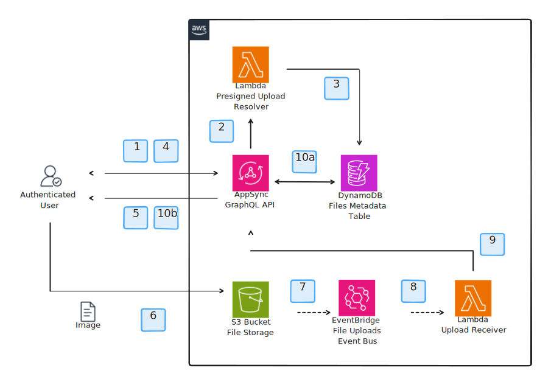

# Content Hub Repository Service

This service is responsible exposing a GraphQL API that allows to upload and download files to/from the media application. The service is also responsible for storing the image assets in a S3 bucket. Whenever an object lands in the S3 bucket, a message is published to an EventBridge event bus that triggers a Lambda function that will mark the object as uploaded. Other services can subscribe to this event bus to be notified when an object is uploaded to perform additional actions.

## Upload a new image

The following section describes the flow and components involved in uploading a new image to the media application.

1. The client sends a GraphQL mutation to the Content Hub Repository service to upload a new image.
2. The AppSync service invokes a Lambda function resolver that generates a pre-signed URL to upload the image to the S3 bucket.
3. The same Lambda function resolver also stores the image metadata in a DynamoDB table.
4. The client receives the pre-signed URL that allows to upload the image directly to the S3 bucket.
5. The client starts a GraphQL subscription to the Content Hub Repository service to be notified about status changes of the image.
6. The client uploads the image to the S3 bucket using the pre-signed URL.
7. The S3 bucket publishes a message to an EventBridge event bus to notify that a new object has been uploaded.
8. The Lambda function subscribed to the EventBridge event bus is invoked and processes the event.
9. The same Lambda function sends a GraphQL mutation to the Content Hub Repository service to mark the image as uploaded.
10. The AppSync service processes the mutation and:
    -  a. Updates the image status in the DynamoDB table.
    -  b. Propagates the mutation to all the clients subscribed to the image status change.

## Download an image

This section describes the flow and components involved in downloading an image from the media application.

1. The client sends a GraphQL query to the Content Hub Repository service to download an image.
2. The AppSync service invokes a Lambda function resolver that generates a pre-signed URL to download the image from the S3 bucket.
3. The same Lambda function resolve also checks the image status and ownership in the DynamoDB table.
4. The client receives the pre-signed URL that allows to download the image directly from the S3 bucket.
5. The client downloads the image from the S3 bucket using the pre-signed URL.