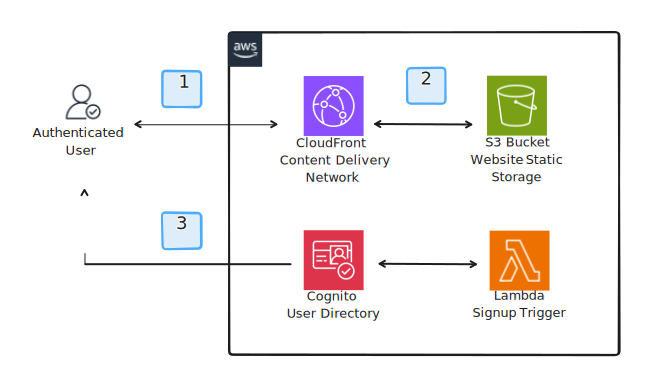

# Frontend Hosting

This component is responsible for providing hosting for the frontend web application. The web application is hosted in an S3 bucket and distributed via CloudFront. Additionally, the component includes the necessary components to enable authentication and authorization for the web application.

## Architecture

1. The user navigates to the frontend web application. If the assets are cached in a point of presence (POP), the user will receive the assets directly without having to make a request to the origin.
2. If the assets are not cached in a POP, the user will receive the assets from the S3 bucket.
3. If the user is not authenticated, they can do so by logging in via the Cognito user pool.
4. In case of new users, upon registration a Lambda function is triggered to automatically mark the user as confirmed.