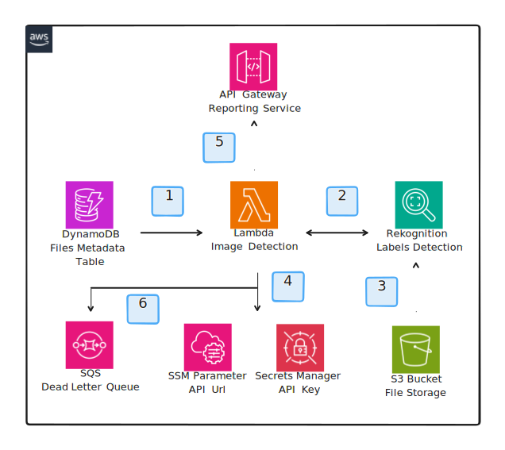

# Image Detection Service

This service is responsible for detecting labels in thumbnails generated by the media application. The service consumes the DynamoDB Stream of the media application and processes all the images that are marked as processed. For each batch of images, the service will invoke a Lambda function that will process the batch by calling the Amazon Rekognition service. If the service detects certain labels it will forward the result to another service via HTTPs call. The function can handle partial failures so that if one or more records cannot be processed it will reported and stored in a dead letter queue without causing the whole batch to fail.

## Architecture

1. A filtered view of the DynamoDB Stream forwards batches of images to the Image Detection Lambda function.
2. The Image Detection Lambda function calls the Amazon Rekognition service to detect labels in each image.
3. The Rekognition service reads the image directly from the S3 bucket and returns the labels detected.
4. If the Rekognition service detects labels that match the configured list of labels, the Image Detection Lambda function fetches the API URL and API Key from SSM and Secrets Manager respectively.
5. Then it forwards the result to the Reporting Service via HTTPs call.
6. If the Image Detection Lambda function fails to process one or more images, it will report the partial failure which will publish the failed records to a dead letter queue.