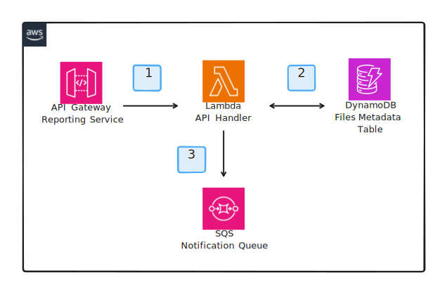

# Reporting Service Architecture

The Reporting Service is responsible for receiving the results of the image detection service whenever a label among the configured list of labels is detected in an image. The service is exposed as a REST API via API Gateway and handles multiple routes using a single Lambda function setup with proxy integration. The Lambda function will validate and parse the request, and then forward the request to the appropriate handler function. The handler function will then process the request and return a response to the client.

## Architecture

1. Requests are sent to the API Gateway endpoint which forwards the request to the API Handler Lambda function which validates and parses the request and then evaluates it according to the configured routes. 
2. If needed, the Lambda function will fetch additional data from the DynamoDB table.
3. Then it will publish the request to a SQS queue for further processing.