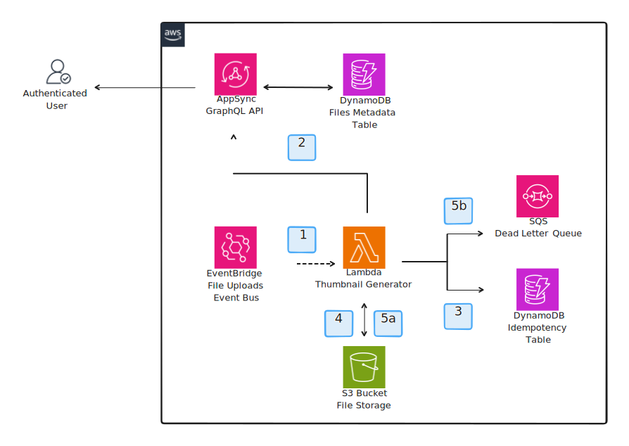

# Thumbnail Generator Service

This service is responsible for generating thumbnails for the images uploaded to the media application. The service is also responsible for storing the thumbnails in a S3 bucket. Whenever an object lands in the S3 bucket, a message is published to an EventBridge event bus that triggers a Lambda function that will read the object and generate the thumbnails. The service propagates real-time updates about the image status to all the clients subscribed to the relevant GraphQL subscription. Additionally, the service is idempotent, which means that if the same image is uploaded multiple times, the service will only generate the thumbnails once based on the object etag. Finally, if the service fails to generate a thumbnail, the event will be published to a dead letter queue (DLQ) for further analysis.

## Architecture

1. When an image is uploaded to the S3 bucket, a message is published to an EventBridge event bus that triggers the thumbnail generator Lambda function.
2. The Lambda function propagates real-time status updates (i.e. `working`, `completed`, or `failed`) to the AppSync GraphQL API so that the clients can be notified about the image status.
3. The operation is checked against the DynamoDB table to ensure that it's idempotent. If the operation has already been processed, the Lambda function will update the status of the image to `completed` and return.
4. If the image is not a duplicate, the Lambda function will download the image from the S3 bucket and generate the thumbnail.
5. Then based on the result of the operation (i.e. `success` or `failure`), the Lambda function will either store the thumbnail in the S3 bucket ("5a") or throw an error so that the message is published to the DLQ ("5b").